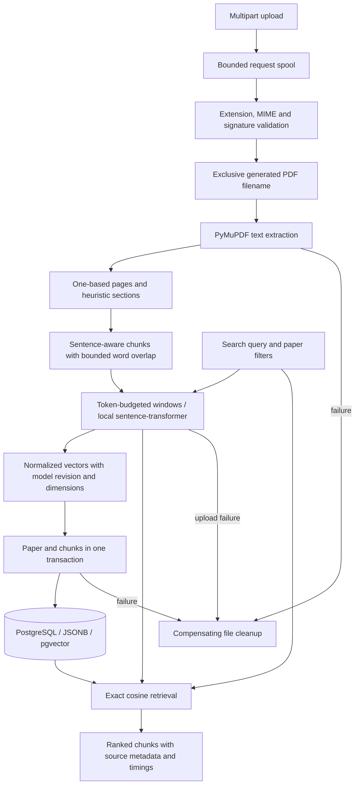

# Architecture — ingestion and dense retrieval

`app.api` validates the HTTP contract. `app.services` coordinates file/database work.
`app.ingestion` contains independently testable parsing, chunking, and storage logic.
`app.retrieval` contains the embedding contract, sentence-transformer implementation,
and exact pgvector retrieval. `app.models` defines persistence; `app.schemas` prevents
internal paths/raw vectors from leaking into responses. `app.db` supplies sessions.
The app factory accepts injected sessions and an embedding provider for tests;
production requires PostgreSQL and uses actual local sentence-transformer inference.

Alembic owns schema changes. Migration 0001 installs pgvector in public and creates
papers/chunks with source metadata, constraints, lookup indexes, and cascading deletion.
Migration 0002 adds model revision/dimension metadata and checks their consistency.
The vector column is dimensionless to permit deliberate model changes; retrieval
strictly filters model spaces. No approximate similarity index is added in Milestone 2.

Extraction uses PDF title/author metadata where available, then title heuristics and
filename fallback. Recognized headings carry across pages. Chunking preserves page and
section boundaries; the embedding adapter then handles actual tokenizer limits separately.
See [retrieval design](retrieval.md) for window pooling, filtering, indexing, and tradeoffs.

Ingestion generates all embeddings before committing the paper and chunks, and cleans
up files on failures. An explicit indexing command backfills existing papers one at a time
while preserving text and IDs. Deletion persists intent, unlinks the file, and deletes rows.
There is no distributed filesystem/database transaction; crash recovery and process-isolated
PDF parsing remain future work. The upload root must be application-controlled.

The planned downstream pipeline adds BM25 → hybrid RRF → optional reranker →
provider-abstracted generation → deterministic citation mapping, alongside retrieval,
generation, and latency evaluation. Those features are not implemented yet.
